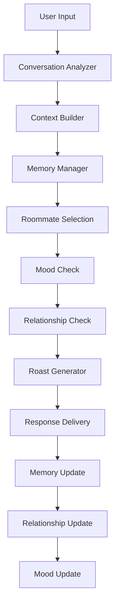

# Design Document

## Overview

This design implements an enhanced personality system and advanced roasting engine for the Flatshare Chaos application. The system will transform static roommate characters into dynamic, memory-enabled personalities with evolving relationships, contextual awareness, and sophisticated roasting strategies.

The design extends the existing `Roommate` dataclass and `Engine` class while maintaining backward compatibility. It introduces new components for memory management, relationship tracking, mood systems, conversation analysis, and context-aware roast generation.

## Architecture

### Core Components

1. **Enhanced Roommate Model** - Extended personality system with memory, relationships, and mood
2. **Memory Manager** - Handles conversation storage, retrieval, and context building
3. **Relationship Engine** - Tracks and manages inter-roommate relationships
4. **Mood System** - Dynamic mood tracking and behavioral influence
5. **Conversation Analyzer** - Pattern recognition and user behavior analysis
6. **Context-Aware Roast Generator** - Intelligent roast creation based on context and history
7. **Cultural Roasting Strategies** - Specialized roasting approaches including Indian-style

### System Flow



## Components and Interfaces

### Enhanced Roommate Model

```python
@dataclass
class EnhancedRoommate(Roommate):
    # Existing fields from base Roommate class
    # New personality fields
    mood: int = 50  # 1-100 scale
    baseline_mood: int = 50
    roasting_strategy: str = "witty"  # aggressive, passive-aggressive, witty, absurd, indian-style
    effectiveness_score: float = 50.0  # percentage of successful roasts
    
    # Relationship tracking
    relationships: Dict[str, int] = field(default_factory=dict)  # roommate_name -> score (0-100)
    
    # Enhanced memory system
    conversation_memory: List[ConversationEntry] = field(default_factory=list)
    user_patterns: Dict[str, Any] = field(default_factory=dict)
    
    # Cultural context for roasting
    cultural_context: Dict[str, Any] = field(default_factory=dict)

@dataclass
class ConversationEntry:
    timestamp: datetime
    speaker: str
    message: str
    context_tags: List[str]
    sentiment: float
    effectiveness_score: Optional[float] = None
```

### Memory Manager

```python
class MemoryManager:
    def __init__(self, max_memory_size: int = 50):
        self.max_memory_size = max_memory_size
    
    def add_conversation(self, roommate: EnhancedRoommate, entry: ConversationEntry) -> None:
        """Add conversation entry and manage memory size"""
    
    def get_relevant_context(self, roommate: EnhancedRoommate, current_topic: str, limit: int = 10) -> List[ConversationEntry]:
        """Retrieve contextually relevant conversation history"""
    
    def analyze_user_patterns(self, roommate: EnhancedRoommate) -> Dict[str, Any]:
        """Analyze user behavior patterns from conversation history"""
    
    def get_conversation_thread(self, roommate: EnhancedRoommate, turns: int = 5) -> List[ConversationEntry]:
        """Get recent conversation thread for context"""
```

### Relationship Engine

```python
class RelationshipEngine:
    def __init__(self):
        self.relationship_matrix: Dict[Tuple[str, str], int] = {}
    
    def update_relationship(self, roommate1: str, roommate2: str, delta: int) -> None:
        """Update relationship score between two roommates"""
    
    def get_relationship_score(self, roommate1: str, roommate2: str) -> int:
        """Get current relationship score (0-100)"""
    
    def should_defend(self, defender: str, target: str) -> bool:
        """Determine if defender should protect target from roasts"""
    
    def get_roast_intensity_modifier(self, roaster: str, target: str) -> float:
        """Get intensity modifier based on relationship"""
```

### Mood System

```python
class MoodSystem:
    def __init__(self):
        self.mood_decay_rate = 0.1  # per minute
    
    def update_mood(self, roommate: EnhancedRoommate, event_type: str, intensity: int) -> None:
        """Update roommate mood based on events"""
    
    def get_mood_modifier(self, roommate: EnhancedRoommate) -> Dict[str, float]:
        """Get behavioral modifiers based on current mood"""
    
    def decay_moods(self, roommates: List[EnhancedRoommate], minutes_passed: float) -> None:
        """Gradually return moods to baseline"""
    
    def should_initiate_roast(self, roommate: EnhancedRoommate) -> bool:
        """Determine if low mood should trigger aggressive behavior"""
```

### Conversation Analyzer

```python
class ConversationAnalyzer:
    def __init__(self):
        self.topic_keywords = self._load_topic_keywords()
        self.sentiment_analyzer = self._init_sentiment_analyzer()
    
    def analyze_message(self, message: str) -> AnalysisResult:
        """Analyze message for topics, sentiment, and patterns"""
    
    def detect_user_patterns(self, conversation_history: List[ConversationEntry]) -> Dict[str, Any]:
        """Identify user behavioral patterns"""
    
    def get_conversation_context(self, recent_messages: List[ConversationEntry]) -> ConversationContext:
        """Build context from recent conversation"""
    
    def calculate_roast_effectiveness(self, roast: str, user_response: str, response_time: float) -> float:
        """Calculate how effective a roast was"""

@dataclass
class AnalysisResult:
    topics: List[str]
    sentiment: float
    urgency: float
    question_count: int
    repeated_phrases: List[str]
    behavioral_flags: List[str]

@dataclass
class ConversationContext:
    current_topic: str
    participants: List[str]
    topic_history: List[str]
    emotional_tone: str
    thread_length: int
```

### Context-Aware Roast Generator

```python
class ContextAwareRoastGenerator:
    def __init__(self, cultural_strategies: Dict[str, 'CulturalRoastingStrategy']):
        self.cultural_strategies = cultural_strategies
        self.roast_templates = self._load_roast_templates()
    
    def generate_roast(
        self,
        roaster: EnhancedRoommate,
        target: str,
        context: ConversationContext,
        user_patterns: Dict[str, Any],
        relationship_score: int,
        mood_modifier: Dict[str, float]
    ) -> str:
        """Generate contextually appropriate roast"""
    
    def select_roasting_strategy(self, roaster: EnhancedRoommate, context: ConversationContext) -> str:
        """Choose appropriate roasting approach"""
    
    def build_roast_prompt(
        self,
        roaster: EnhancedRoommate,
        target: str,
        context_elements: List[str],
        strategy: str
    ) -> Tuple[str, str]:
        """Build system and user prompts for LLM"""
```

### Cultural Roasting Strategies

```python
class CulturalRoastingStrategy(ABC):
    @abstractmethod
    def get_roast_elements(self, context: ConversationContext, user_patterns: Dict[str, Any]) -> List[str]:
        """Get culture-specific roast elements"""
    
    @abstractmethod
    def get_system_prompt_additions(self) -> str:
        """Get additional system prompt context"""

class IndianRoastingStrategy(CulturalRoastingStrategy):
    def __init__(self):
        self.academic_references = ["engineering", "medical school", "IIT", "competitive exams"]
        self.family_references = ["aunties", "arranged marriage", "family expectations", "beta"]
        self.food_references = ["mother's cooking", "ghar ka khana", "specific dishes"]
        self.career_references = ["stable job", "government job", "parental approval"]
        self.cultural_phrases = ["what will people say", "log kya kahenge", "Sharma ji ka beta"]
    
    def get_roast_elements(self, context: ConversationContext, user_patterns: Dict[str, Any]) -> List[str]:
        """Generate Indian-style roast elements based on context"""
    
    def get_system_prompt_additions(self) -> str:
        """Add Indian cultural context to system prompt"""
```

## Data Models

### Enhanced Persona Configuration

```json
{
  "name": "Desi Deepak",
  "style": "Indian uncle vibes",
  "roast_signature": "cultural comparisons and family expectations",
  "roasting_strategy": "indian-style",
  "quirks": [
    "Beta, in my time...",
    "Your mother called, she's disappointed"
  ],
  "triggers": {
    "career": ["What about stable job? Engineering is better"],
    "food": ["This is not how my mother makes it"],
    "relationships": ["When are you getting married? Aunties are asking"]
  },
  "cultural_context": {
    "type": "indian",
    "references": {
      "academic": ["IIT", "medical school", "engineering", "competitive exams"],
      "family": ["aunties", "beta", "arranged marriage", "family expectations"],
      "food": ["ghar ka khana", "mother's cooking", "proper Indian food"],
      "social": ["what will people say", "log kya kahenge", "society expectations"]
    }
  },
  "baseline_mood": 45,
  "spice": 3
}
```

### Memory Storage Schema

```python
# Conversation entries stored in roommate memory
{
  "timestamp": "2024-01-15T10:30:00Z",
  "speaker": "user",
  "message": "I'm thinking about changing careers",
  "context_tags": ["career", "uncertainty", "life_change"],
  "sentiment": -0.2,
  "effectiveness_score": null
}

# User pattern analysis
{
  "frequent_topics": {"career": 15, "food": 8, "relationships": 3},
  "speech_patterns": ["I think", "maybe", "not sure"],
  "response_style": "lengthy_responses",
  "roast_sensitivity": 0.7,
  "preferred_interaction_time": "evening",
  "conversation_triggers": ["work stress", "decision making"]
}
```

## Error Handling

### Memory Management Errors
- **Memory Overflow**: Implement LRU eviction when memory exceeds limits
- **Corrupted Memory**: Validate conversation entries and recover gracefully
- **Context Retrieval Failures**: Fall back to recent conversation history

### Relationship System Errors
- **Invalid Relationship Updates**: Clamp scores to valid ranges (0-100)
- **Missing Relationship Data**: Initialize with neutral scores (50)
- **Circular Relationship Logic**: Prevent infinite loops in relationship calculations

### Mood System Errors
- **Mood Boundary Violations**: Enforce mood ranges (1-100)
- **Rapid Mood Swings**: Implement rate limiting for mood changes
- **Baseline Drift**: Periodically reset to configured baseline

### Roast Generation Errors
- **Context Unavailable**: Fall back to basic roasting when context is missing
- **Cultural Strategy Failures**: Default to generic roasting strategy
- **LLM Generation Failures**: Use pre-defined backup roasts

## Testing Strategy

### Unit Tests
- **Memory Manager**: Test conversation storage, retrieval, and pattern analysis
- **Relationship Engine**: Test relationship updates and score calculations
- **Mood System**: Test mood changes and behavioral modifiers
- **Conversation Analyzer**: Test message analysis and pattern detection
- **Cultural Strategies**: Test culture-specific roast element generation

### Integration Tests
- **End-to-End Conversation Flow**: Test complete conversation with memory updates
- **Multi-Roommate Interactions**: Test relationship dynamics and coordination
- **Context Preservation**: Test conversation thread continuity
- **Cultural Roasting**: Test Indian-style roasting integration

### Performance Tests
- **Memory Efficiency**: Test memory usage with large conversation histories
- **Response Time**: Test roast generation speed with complex context
- **Concurrent Users**: Test system behavior with multiple conversation threads

### Behavioral Tests
- **Personality Consistency**: Verify roommates maintain character traits
- **Relationship Evolution**: Test relationship changes over time
- **Mood Impact**: Verify mood affects behavior appropriately
- **Cultural Authenticity**: Test cultural roasting accuracy and sensitivity